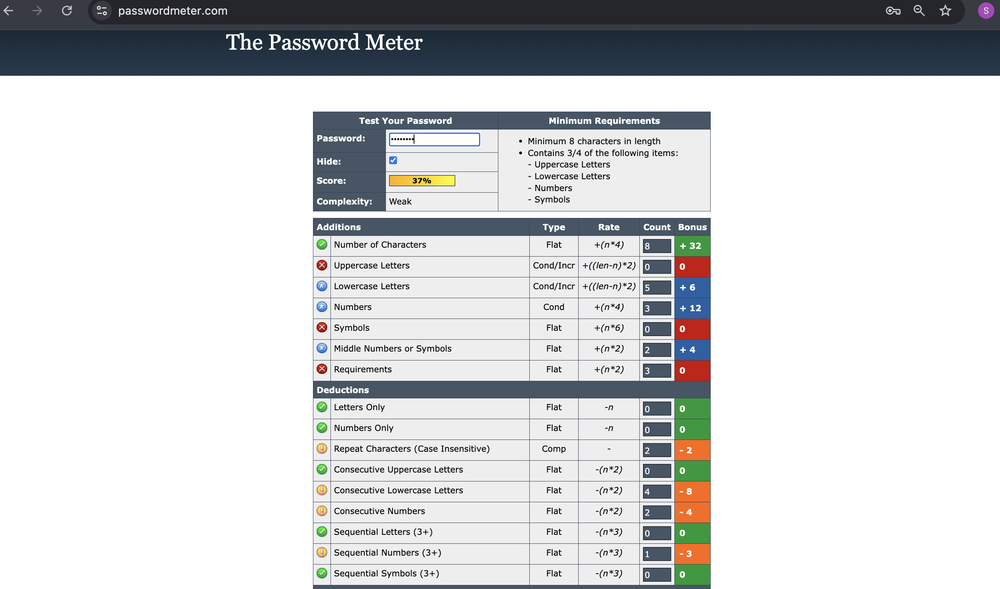
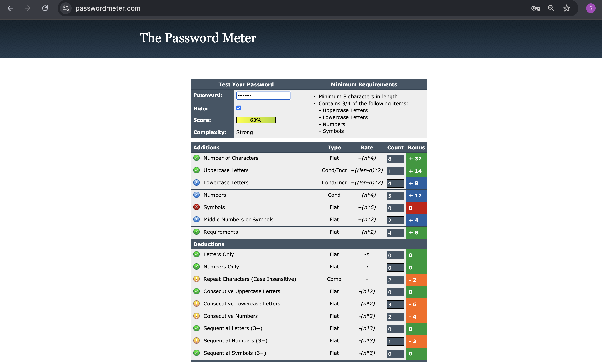
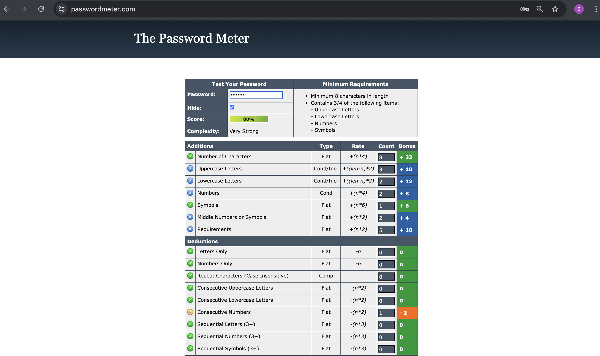
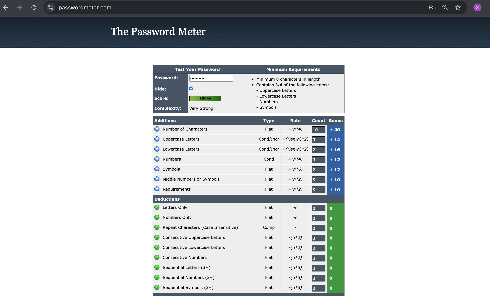
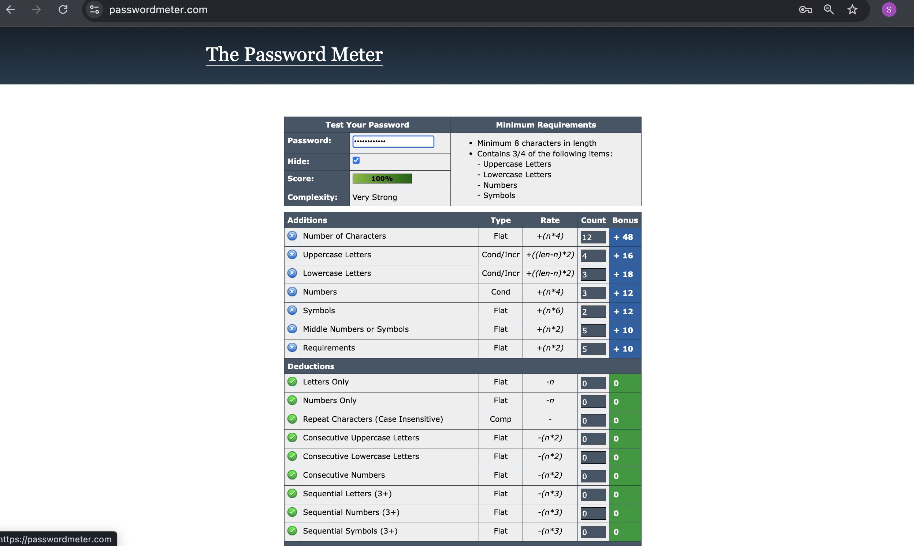

# Task 6: Create a Strong Password and Evaluate Its Strength

## 📌 Objective
Understand the characteristics of a strong password and evaluate password strength using an online password strength checker.

---

## 🛠 Tools Used
- [PasswordMeter.com](https://passwordmeter.com) – to evaluate password strength.

---

## 📋 Steps Performed

1. **Created multiple passwords** with varying complexity:
   - Included variations in **length**, **uppercase**, **lowercase**, **numbers**, and **symbols**.
2. **Tested each password** on PasswordMeter.
3. **Recorded scores and feedback** for each password.
4. **Identified best practices** for creating strong passwords.
5. **Researched common password attacks** and how complexity affects security.

---

## 🔐 Password Strength Evaluation

| Password       | Length | Score (%) | Feedback |
|----------------|--------|-----------|----------|
| apple123     | 8      | ~25%      | Weak — contains dictionary word, too short, lacks symbols. |
| Apple1234    | 8      | ~40%      | Fair — added uppercase, still predictable. |
| ApPlE!23     | 8      | ~60%      | Good — symbols improve security, but short length. |
| A#7kL2@9zM   | 10     | ~85%      | Strong — random mix, better length. |
| M$5qR1x@8YhP | 12     | ~100%     | Very strong — long, random, all character types. |

> **Note:** Scores may slightly vary depending on the tool used.

---

## 📸 Password Strength Test Screenshots  
(All tests were done on [PasswordMeter.com](https://passwordmeter.com))  

| Password         | Screenshot |
|------------------|------------|
| `apple123`       |  |
| `Apple1234`      |  |
| `ApPlE!23`       |  |
| `A#7kL2@9zM`     |  |
| `M$5qR1x@8YhP`   |  |

---

## 🧠 Key Learnings & Best Practices

- Use **12+ characters** for better security.
- Include **uppercase, lowercase, numbers, and symbols**.
- Avoid **dictionary words** and **predictable patterns**.
- Use **random strings** or **passphrases** for memorability.
- Avoid reusing passwords across different accounts.
- Enable **Two-Factor Authentication (2FA)** wherever possible.

---

## 🛡 Common Password Attacks

| Attack Type         | Description |
|---------------------|-------------|
| **Brute Force**     | Tries every possible combination of characters until the password is found. |
| **Dictionary Attack** | Uses a list of common words/passwords to guess quickly. |
| **Credential Stuffing** | Reuses stolen credentials from data breaches. |
| **Phishing**        | Tricks the user into revealing their password. |

---

## 📈 Impact of Complexity on Security
- **Short + Simple passwords** can be cracked within seconds.
- **Long + Complex passwords** can take years or centuries to crack.
- Password **entropy** (unpredictability) is key to resisting attacks.

---
